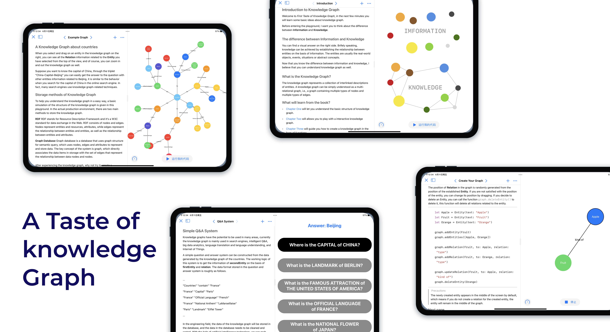

# KnowledgeGraph
## Introduction

I developed a Swift Playground that teaches and guides users on how knowledge graph works.

## Details
In this Playground, I first let the user understand what the original purpose of the Knowledge Graph was and what problems it needed to solve, then I let the user observe and interact with a constructed Knowledge Graph, then I taught the user how to construct a Knowledge Graph with simple statements, and finally the user can quickly understand some kind of use of the Knowledge Graph with a simple example. 

## Installation Guide
1. Download the Swift Playgrounds app from App Store on your iPad or download it from  Mac App Store on your Mac.
2. Download the FirstTasteofKnowledgeGraph.playgroundbook.zip file from this repository and unzip it.
3. Use AirDrop to send the file to your iPad to experience or open it directly on your Mac's Swift Playgrounds app.